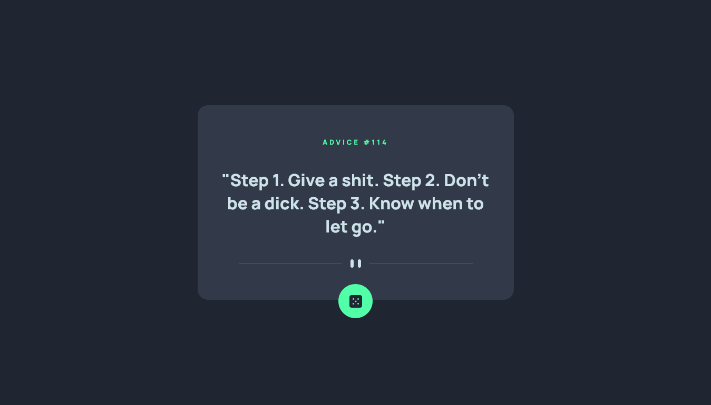

# Frontend Mentor - Advice generator app solution

This is a solution to the [Advice generator app challenge on Frontend Mentor](https://www.frontendmentor.io/challenges/advice-generator-app-QdUG-13db). Frontend Mentor challenges help you improve your coding skills by building realistic projects.

## Table of contents

- [Overview](#overview)
  - [The challenge](#the-challenge)
  - [Screenshot](#screenshot)
  - [Links](#links)
- [My process](#my-process)
  - [Built with](#built-with)
- [Author](#author)

## Overview

### The challenge

Users should be able to:

- View the optimal layout for the app depending on their device's screen size
- See hover states for all interactive elements on the page
- Generate a new piece of advice by clicking the dice icon

### Screenshot

### Links

- Solution URL: [Solution URL](https://www.frontendmentor.io/solutions/advice-generetor-made-w-api-async-reactjs-vite-css-variables-VGvtnEG8pk)
- Live Site URL: [Live site](https://hilarious-torte-de4f17.netlify.app/)
- Site Repositorie: [Site Repositorie](https://github.com/DantDev/advice-gen)

## My process

### Built with

- Semantic HTML5 markup
- CSS custom properties
- Flexbox
- async fetch From API
- Mobile-first workflow
- [React](https://reactjs.org/) - JS library
- [Vite](https://vitejs.dev/)

## Author

- Website - [My Portfolio](https://wondrous-chaja-b0f2e7.netlify.app/)
- Frontend Mentor - [@DantDev](https://www.frontendmentor.io/profile/DantDev)
- Instagram - [@p3drr0](https://www.instagram.com/p3drr0)
- GitHub - [@DantDev](https://github.com/DantDev)
